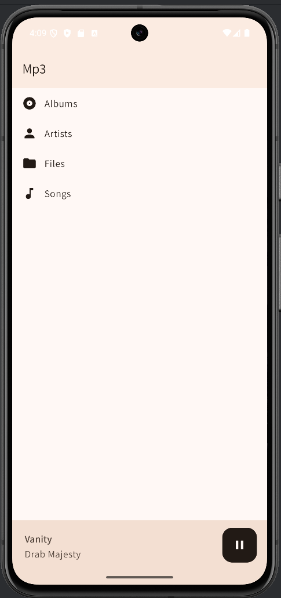
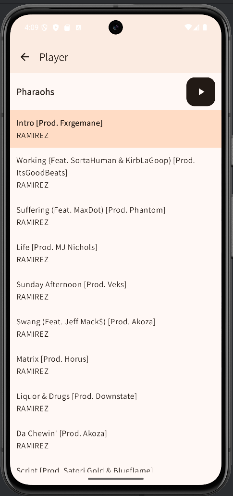

# MP3 Player

Renders and plays music found in your Android device's `Music` directory. 

Isdale Revisions: Optionally do AudioBooks folder and use short display names

## Motivation

I miss the early 2000's when I had an ipod. Today's mp3 player options are subpar. They are
full of proprietary buggy software, or are very expensive. 

The default music manager for android is also annoying. It's a lot of taps to just find
the Music directory. 

The MP3 player options in the app stores also come with ads. 

So after exhausting my options, I am building my own mp3 player app. 